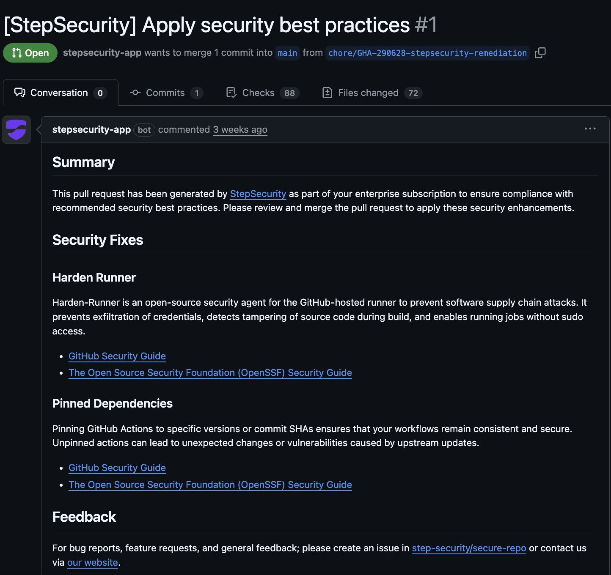
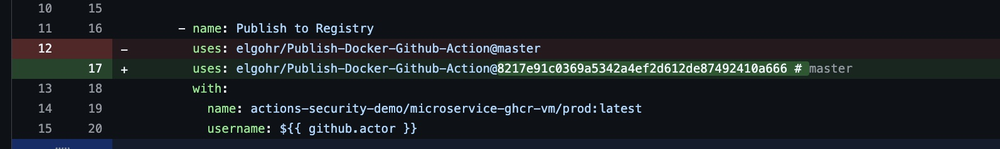
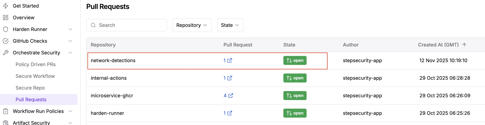

# Policy Driven PR's – Automating Fixes with Pull Requests 
 
Policy Driven PR's allow you to automate security remediation across your repositories by automatically generating Pull Requests to fix issues or creating GitHub Issues to track vulnerabilities. For more information, see [here](https://docs.stepsecurity.io/orchestrate-security/policy-driven-prs) 

This repository contains workflows and configurations that will fail the controls listed below, and will prompt a PR to be opened to fix the issues (e.g., pinning actions by commit SHA, replacing action with maintained action, adding dependabot configuration).

## Supported Controls
This feature allows you to automatically fix and align with the following controls:

| Control | Description |
|------|-------------|
| Harden GitHub-Hosted Runner | Ensures Harden-Runner is installed on GitHub-hosted runners. Often used to deploy harden-runner at scale |
| Pin Actions to Full-Length Commit SHA | Pin actions to full-length commit SHAs to follow best security practices |
| Restrict GitHub Token Permissions | Restrict default GitHub token permissions to minimal required permissions |
| Pin image tags to digests in Dockerfiles | Docker tags are mutable, so use digests in place of tags when pulling images |
| Replace third party actions with StepSecurity maintained actions | Use secure, audited GitHub actions maintained by StepSecurity to reduce supply chain risks |
| Update Dependabot configuration | Manage Dependabot configuration to help keep dependency versions up to date |
| Update the pre-commit configuration | Pre-commit hooks are useful for enforcing code quality, code formatting, and detecting security vulnerabilities. |
| Add GitHub Actions from the Workflows Templates | Add workflows that are part of the organization's recommended set and were previously missing from the repository |

## Prerequisites

1. Ensure you have installed the [Basic StepSecurity GitHub App](https://github.com/apps/stepsecurity-actions-security) and the [Advanced StepSecurity GitHub App](https://github.com/apps/stepsecurity-app), and have access to your StepSecurity dashboard
2. Fork/clone this repository into your own Organization, or use an existing repository within your Organization. **This feature does not make changes - it will only open PR's to suggest fixes** on **explicitly selected repositories**
   
## Testing Controls 

Policy Driven PR's can be applied on a repo by repo basis or across your entire organization. Daily scans will check for misconfigurations on your test repository (based on the [`misconfigured.yml`](https://github.com/stepsecurity-poc/stepsecurity-poc-policy-driven-pr/blob/main/.github/workflows/misconfigured.yml) workflow) and automatically create a pull request if any are found. *Note: It may take up to 1 hour for the actions/new repositories to reflect in the StepSecurity dashboard*

* Enbale Policy Driven PRs in the StepSecurity dashboard under Orchestrate **Orchestrate Security → Policy Driven PRs** 
  1) Select which controls you want to apply for the policy - for testing - it is recommended to run all 8 controls. *Note: Some controls will ask for specifics such as which actions to replace - choose any available maintained actions. If nothing shows, check back in 1 hour* 
  2) Select the test repository (forked or your own) that contains the workflow above. 
  3) Once you **save** the policy, it will do a first scan within ~15 minutes, and open a PR to apply fixes based on the controls you selected. From here, it will do a daily scan to address misconfigurations. 

## Viewing and Managing PRs 

Once a PR is opened, you can view it in your repository. The template and messaging can be customized from the StepSecurity dashboard. Click on the **Files Changed** tab to see proposed changes:

Proposed changes example - pinning by commit SHA: 

Within the StepSecurity dashboard, click on **Orchestrate Security → Pull Requests** to see an overview of all PRs opened in one place. Here you can filter by status (e.g., Opened, Closed, Merged):

